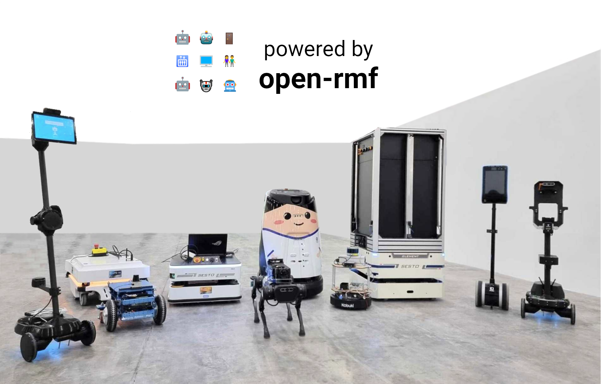

# Robotics Middleware Framework (Open-RMF)




The Open-RMF platform for multi-fleet robot management.

---

## Installation Instructions

Open-RMF is a collection of packages, some of which have ROS 2 dependencies.
For convenience, we distribute and install Open-RMF along with ROS 2 and is currently supported for the following ROS 2 distributions:
* [Iron Irwini](https://docs.ros.org/en/iron/index.html) (`iron`)
* [Humble Hawksbill](https://docs.ros.org/en/humble/index.html) (`humble`)
* [Rolling Ridley](https://docs.ros.org/en/rolling/index.html) (`rolling`)

We primarily support Debian packages on `Ubuntu Linux - Jammy Jellyfish (22.04)` and select RPM packages for `RHEL/Fedora` for both `amd64` and `aarch64` architectures.

Options for installing Open-RMF:
* [Binary installation (recommended)](#binary-installation)
* [Building from source](#building-from-source)

If you want to try Open-RMF we recommend installing the binaries. Building from source is better suited for developers who wish to add new features or fix bugs.

### Setup
Instruction below are aimed at `Ubuntu 22.04`.

First please follow the installation instructions to install ROS 2 for the `distro` of choice from supported versions listed above.
It is recommended to install ROS 2 via binary debians.

> Note: In order to install Open-RMF binaries, it is important to setup your computer to install ROS packages. This is a [prerequisite step](https://docs.ros.org/en/rolling/Installation/Ubuntu-Install-Debians.html#enable-required-repositories) when installing ROS 2 debian binaries.

Install all non-ROS dependencies of Open-RMF packages,

```bash
sudo apt update && sudo apt install \
  python3-pip \
  curl \
  python3-colcon-mixin \
  ros-dev-tools \
  -y

sudo sh -c 'echo "deb http://packages.osrfoundation.org/gazebo/ubuntu-stable `lsb_release -cs` main" > /etc/apt/sources.list.d/gazebo-stable.list'
wget https://packages.osrfoundation.org/gazebo.key -O - | sudo apt-key add -

# These pip packages are only used by rmf_demos which are not released as binaries
python3 -m pip install flask-socketio fastapi uvicorn
```

`rosdep` helps install dependencies for ROS packages across various distros and will be installed along with `ros-dev-tools`.
However, it is important to update it.

```bash
sudo rosdep init # run if first time using rosdep.
rosdep update
```

Update `colcon mixin` if you have not done so previously.

```bash
colcon mixin add default https://raw.githubusercontent.com/colcon/colcon-mixin-repository/master/index.yaml
colcon mixin update default
```

### Binary installation
First follow the instruction in the [Setup section](#setup).
Finally install Open-RMF debian packages for the `distro` of choice.

```bash
sudo apt update && sudo apt install ros-<distro>-rmf-dev
```

**Note:** This will install all necessary debian packages to run Open-RMF except for those in [rmf_demos](https://github.com/open-rmf/rmf_demos) for reasons described in this [issue](https://github.com/open-rmf/rmf_demos/issues/166).

To build `rmf_demos` from source, first determine the version of `rmf_demos` that corresponds to the latest binary release for your distro.
For example, if you installed the `humble` binaries of Open-RMF, the version of `rmf_demos` for this release can be found in the `rmf.repos` file in the `humble-release` branch of this repository, for example [here](https://github.com/open-rmf/rmf/blob/591b0b9f34a021d81522a0af6f42ffcb5fc70293/rmf.repos#L5).

Next create a ROS 2 workspace and build `rmf_demos` from source.
Replace the `2.0.3` tag below with the version of `rmf_demos` for your distribution.

```bash
mkdir ~/rmf_ws/src -p
cd ~/rmf_ws/src
git clone https://github.com/open-rmf/rmf_demos.git -b 2.0.3
cd ~/rmf_ws
colcon build
```

To run some demonstrations of Open-RMF in simulation, see [README in rmf_demos](https://github.com/open-rmf/rmf_demos).

### Building from source
First follow the instruction in the [Setup section](#setup).

Due to newer changes in the source code, there might be conflicts and compilation errors with older header files installed by the binaries. Hence before proceeding, make sure to uninstall all Open-RMF binaries for the ROS 2 distro that will be sourced for the build.
```bash
sudo apt purge ros-<distro>-rmf* && sudo apt autoremove
```

#### Download the source code
Open-RMF is a collection of several repositories/packages.
The [rmf.repos](https://github.com/open-rmf/rmf/blob/main/rmf.repos) provides a snapshot of these packages.
This repository stores different versions of this file depending on the ROS 2 distribution and version of the release.
Depending on the use case, you may choose to download this file from one of the following branches in this repository:
* `main` : Latest version of all packages which may or may not have a binary release yet. This is recommended for development and bug fixes.
* `<distro>`: The latest version of the packages for a specific ROS 2 distro. This may be different from `main` as new API/ABI breaking features merged into `main` will not be backported into `<distro>` branches. The packages downloaded from `<distro>` may have changes that are not yet available in binaries.
* `<distro>-release` : Where `<distro>` is a supported ROS 2 distribution (eg. `humble`). The version of packages here will correspond to those of the latest binaries available for this distro.
* `release-<distro>-YYMMDD` : A tag for a specific `<distro>` where the version of packages correspond to those of the binaries available on `YYMMDD`. See [Releases](https://github.com/open-rmf/rmf/releases) for additional information for each release. This is useful if users would like to build packages from an older release.


Setup a new ROS 2 workspace and pull in the demo repositories using `vcs`.
Replace `main` with the branch of your choice.

```bash
mkdir -p ~/rmf_ws/src
cd ~/rmf_ws
wget https://raw.githubusercontent.com/open-rmf/rmf/main/rmf.repos
vcs import src < rmf.repos
```

Install dependencies via `rosdep`.
Replace `humble` with ROS 2 distro of your choice.

```bash
cd ~/rmf_ws
rosdep install --from-paths src --ignore-src --rosdistro humble -y
```

**NOTE: We strongly recommend compiling Open-RMF packages with `clang` as compiler and `lld` as linker.**

```bash
sudo apt update
sudo apt install clang clang-tools lldb lld libstdc++-12-dev
```

Compile the workspace after sourcing the ROS 2 distro of choice.

```bash
cd ~/rmf_ws
source /opt/ros/humble/setup.bash # replace humble with ROS 2 distro of choice.

export CXX=clang++
export CC=clang
colcon build --mixin release lld
```

> NOTE: The first time the build occurs, many simulation models will be downloaded from Gazebo Fuel to populate the scene when the simulation is run. As a result, the first build can take a very long time depending on the server load and your internet connection (may be up to an hour). To build without downloading models append `--cmake-args -DNO_DOWNLOAD_MODELS=On` to the `colcon build`

To run some demonstrations of Open-RMF in simulation, see [README in rmf_demos](https://github.com/open-rmf/rmf_demos).

### Docker Containers

We also provide a [docker](https://docs.docker.com/engine/install/ubuntu/) image for Open-RMF.

Pull the docker image from `open-rmf/rmf` github registry (setup refer [here](https://docs.github.com/en/free-pro-team@latest/packages/using-github-packages-with-your-projects-ecosystem/configuring-docker-for-use-with-github-packages#authenticating-with-a-personal-access-token)).

```bash
docker pull ghcr.io/open-rmf/rmf/rmf_demos:latest
docker tag ghcr.io/open-rmf/rmf/rmf_demos:latest rmf:latest
```

Run it!

```bash

docker run -it --network host rmf:latest bash -c "export ROS_DOMAIN_ID=9; ros2 launch rmf_demos_gz office.launch.xml headless:=1"
```

This will run `rmf_demos` in headless mode. Open [this link](https://open-rmf.github.io/rmf-panel-js/) with a browser to start a task.

(Experimental) User can also run `rmf_demos` in “non-headless” graphical form, via [rocker](https://github.com/osrf/rocker).

## Run RMF Demos

Demonstrations of Open-RMF are shown in [rmf_demos](https://github.com/open-rmf/rmf_demos/).

## Roadmap

A near-term roadmap of the entire Open-RMF project (including and beyond `rmf_traffic`) can be found in the user manual [here](https://osrf.github.io/ros2multirobotbook/roadmap.html).

## Integrating with RMF

Instructions on how to integrate your system with Open-RMF can be found [here](https://osrf.github.io/ros2multirobotbook/integration.html).

## Open sourced adapters

A number of commercial robots, infrastructure systems, workcells and devices have been integrated with Open-RMF and links to their adapters are available in the [awesome_adapter](https://github.com/open-rmf/awesome_adapters) repository

Help us add to this list!

A helpful starting point for integrating your fleet with RMF is the [fleet_adapter_template](https://github.com/open-rmf/free_fleet) package.

## Development and Release

More information for on the development and release process may be found [here](docs/Development-and-Release.md)
